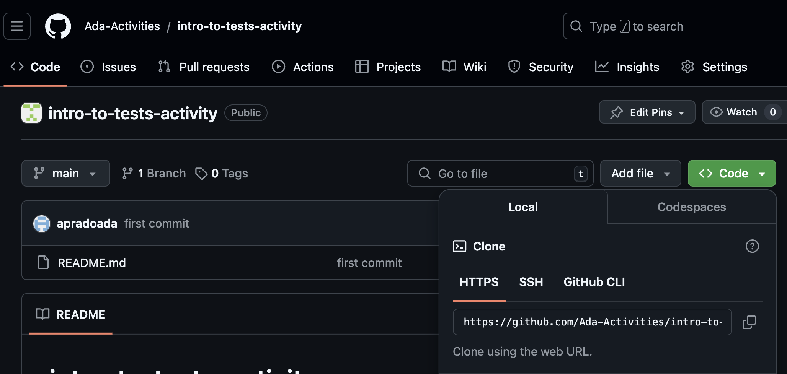
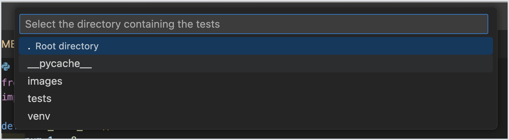
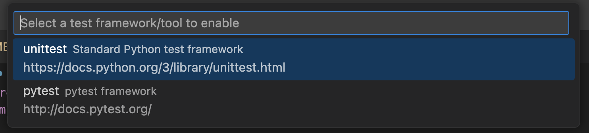
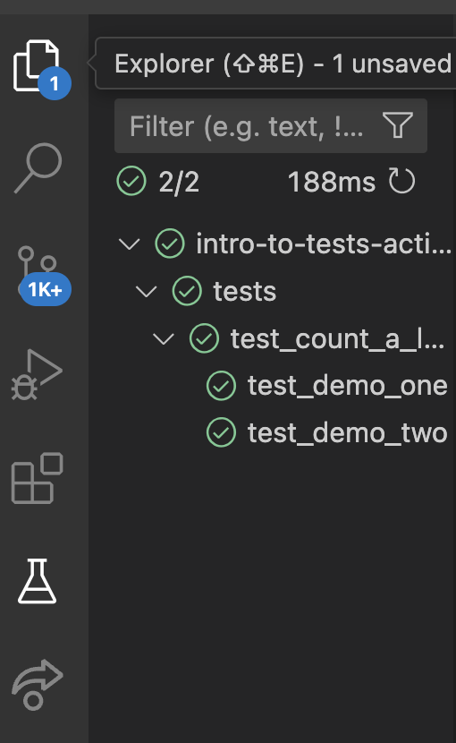
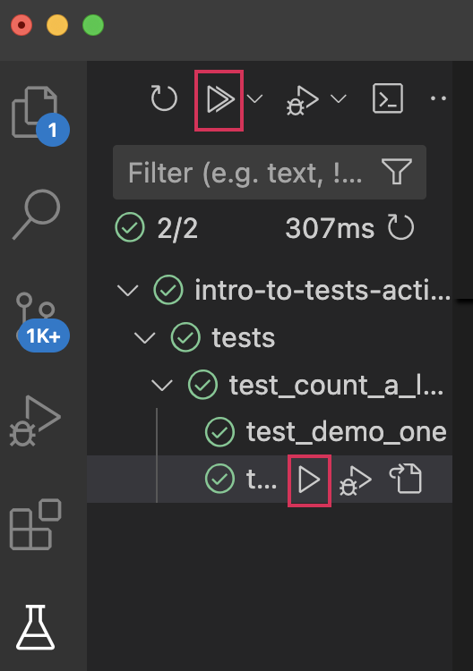

# Intro To Tests Activity 
This repository is part of the class activity for Intro to Tests in Unit 1.

## Learning Goals
- Practice identifying test cases
- Practice writing tests with pytest

### Part 1: One-Time Setup

Follow these directions once when you start working on this activity **during roundtables**:

1. Navigate to your projects folder named `projects`

```bash
$ cd ~/Developer/projects
```

2. In Github click on the green "Code" button in Github and then copy the URL. This will allow you to download a copy of this project into your projects folder. This command makes a new folder called `intro-to-tests-activity`, and then puts the project into this new folder. 



3. After copying the URL, run the following command in your terminal:

```
$ git clone <paste your copied URL here>
```

Use `ls` to confirm there's a new project folder

1. Move your location into this project folder

```bash
$ cd intro-to-tests-activity
```

2. Create a virtual environment named `venv` for this project:

```bash
$ python3 -m venv venv
```

3. Activate this environment:

```bash
$ source venv/bin/activate
```

Verify that you're in a python3 virtual environment by running:

- `$ python --version` should output a Python 3 version
- `$ pip --version` should output that it is working with Python 3

4. Install dependencies once at the beginning of this project while your virtual environment is activated. Note that `(venv)` is not part of the command below that you need to run.

```bash
$ (venv) pip install -r requirements.txt
```

### Part 2: Writing Tests
We will be writing tests for some pre-written code. Once everyone has the repo cloned and ready to go, follow the steps below together. 

1. Look through the directory structure to familiarize yourself with how the files are organized. 
2. Look at the feature provided in `main.py` and discuss as a group what it is meant to be doing.
3. As a group, come up with a few nominal and edge cases you would like to test relating to the feature provided.
4. Find the appropriate file in which to write your tests and start writing them. 

*NOTE* There are currently two prewritten dummy tests used for demonstration purposes. Feel free to delete these once you have written your own tests.

### Part 2.5: Running Tests Via Console
1. Find the test file that contains the test you want to run.

   - Check the `tests` folder, and find the test file you want to run
   - In that test file, read through each test case


2. Run the tests for that specific project

```bash
# Must be in activated virtual environment
$ pytest tests/test_count_a_letter.py
```

3. Run all tests that exist in this project with:

```bash
# Must be in activated virtual environment
$ pytest
```

4. If you want to see any `print` statements print to the console, add `-s` to the end of any `pytest` command:

```bash
# Must be in activated virtual environment
$ pytest -s
```

### Part 3: Running Tests Via VSCode
1. With pytest installed, you should see a beaker icon in the toolbar on the left. Click the icon and you should be prompted with an opportunity to configure test. Click the button to configure tests.



2. A selector will pop up at the top of your VS Code asking which testing framework you would like to use. By default, unittest will be selected. Make sure you select *pytest*



3. The selector will then ask which directory our tests are in. As they are currently in the `tests` directory, select `tests`.


4. If done correctly, you should now see your tests pop up in the sidebar, similar to what is below:



5. To run tests all at once, press the play button at the top of the test exploration tab. To run a single test, open up the test tree, hover over the test you want to run and press the play button.

